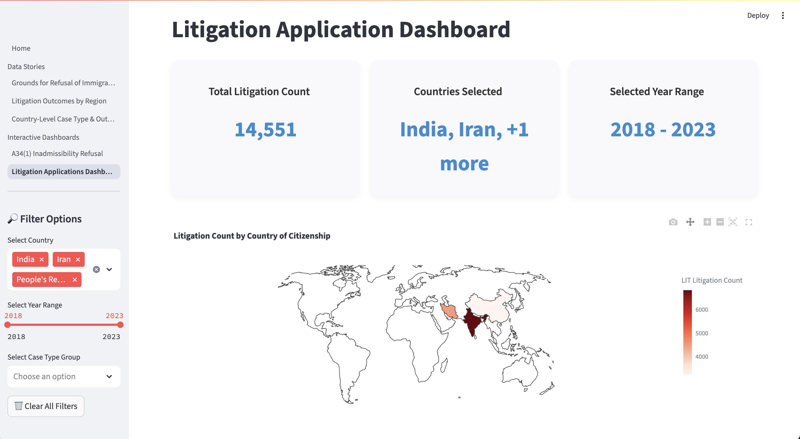

# Public-Transparency-for-Immigration-Law-Canada

**Authors**: Ismail (Husain) Bhinderwala, Jessica Yu, Ke Gao, Yichun Liu 

**Affiliation**: University of British Columbia, Heron Law Offices and AIMICI 
**Duration**: April, 2025 – June, 2025

------------------------------------------------------------------------

# Welcome!

🌟 We're so glad you're here! Thank you for visiting the our project repository.

🌟 This README is a friendly guide to everything about the project. Whether you're here to explore what our dashboard offers, learn about our mission, or find ways to contribute, you've come to the right place! 🥳

# Project Summary

This project investigates patterns in immigration inadmissibility decisions in Canada Using structured datasets from **Immigration, Refugees and Citizenship Canada (IRCC)** and unstructured [**federal court decision texts**](https://huggingface.co/datasets/refugee-law-lab/canadian-legal-data), we aim to uncover insights into legal trends, systemic disparities, and judicial decision-making.

The project leverages exploratory data analysis, statistical inference and natural language processing. The final product will be a **public-facing interactive dashboard** built using **Python and Streamlit**, designed to make these datasets interpretable for legal professionals, policymakers, and the public.

---
## Dependencies

- [Conda](https://anaconda.org/anaconda/conda)
- [VS Code](https://code.visualstudio.com/download)
- [VS Code Jupyter Extension](https://marketplace.visualstudio.com/items?itemName=ms-toolsai.jupyter)
---

# Getting Started

#### Clone the Repository

``` bash
git clone https://github.com/ismailbhinder/Public-Transparency-for-Immigration-Law-Canada.git
```

### Setting the environment:

From the **project root directory**, run the following commands:

``` bash
conda-lock install --name heron_law conda-lock.yml
```

and then activate the conda environment using:

``` bash
conda activate heron_law
```

------------------------------------------------------------------------

## Running the Dashboard Locally

This repository contains several Streamlit pages located in `dashboard/pages/`. You have two main ways to explore them:

#### Option 1: Full Dashboard (All in One)

Launch a complete dashboard with 3 curated Data Stories + 2 interactive explorers from the **project root directory** using the following command in the terminal where the conda enivornment is active.

``` bash
# full dashboard (3 stories + 2 explorers)
streamlit run dashboard/pages/index.py
```
You can find our dashboard deployed [here](https://public-transparency-for-immigration-law-in-canada.streamlit.app/)

#### Option 2: Run Individual Modules

If you want to launch just one page, you can run any of the following scripts from the **project root directory**.

| Script                      | What it shows                                                         | Command                                   |
|-------------------|--------------------------------|---------------------|
| `a34_story.py`              | A34(1) Refusals interactive explorer                                  | `streamlit run dashboard/pages/a34_story.py`              |
| `africa_vs_non_africa.py`   | Litigation Outcomes story by continent-level (Africa vs. Non-Africa)  | `streamlit run dashboard/pages/africa_vs_non_africa.py`   |
| `litigation_dashboard.py`   | Litigation Outcomes story by country-level                            | `streamlit run ldashboard/pages/itigation_dashboard.py`   |
| `litigation_interactive.py` | Litigation Applications interactive explorer                          | `streamlit run dashboard/pages/litigation_interactive.py` |

A screenshot of our dashboard: 

## Running the LLM Pipeline

From the **project root directory** first navigate to `data_product` folder by running the following command in the terminal:
```bash
cd data_product/
```

Then run the `llm_processing_pipeline.ipynb` in VS Code or JupyterLab

## Data Quality report

From the **project root directory** first navigate to `data_product/data_quality_report/` folder by running the following command in the terminal:
```bash
cd data_product/data_quality_report/
```

Then to generate the Data Quality Report in pdf, run this command in the terminal:
```bash
quarto render data_quality_report.qmd --to pdf
```

## Rendering the Report

From the **project root directory**, run the following commands:

#### Preview the Final Report in a browser:

```bash
quarto preview report/final_report/final_report.qmd

To generate final HTML output:

```bash
quarto render report/final_report/final_report.qmd --to html
```

To generate final PDF output:

``` bash
quarto render report/final_report/final_report.qmd --to pdf
```

------------------------------------------------------------------------

# Developer dependencies

-   `conda` (version 23.9.0 or higher)
-   `conda-lock` (version 2.5.7 or higher)

# Adding a new dependency

1.  Add the dependency to the `environment.yml` file on a new branch.

2.  Run `conda-lock lock --file environment.yml` to update the `conda-lock.yml` file.

3.  Push the changes to GitHub.

4.  Send a pull request to merge the changes into the `main` branch.

------------------------------------------------------------------------
